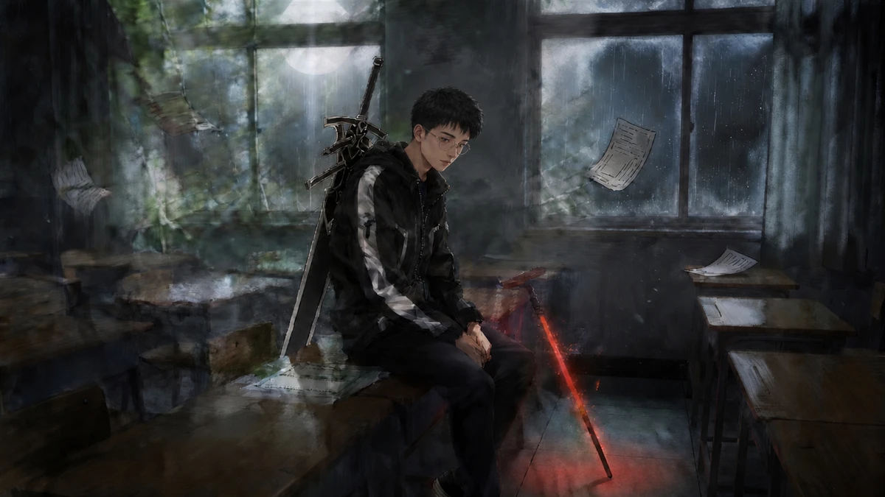
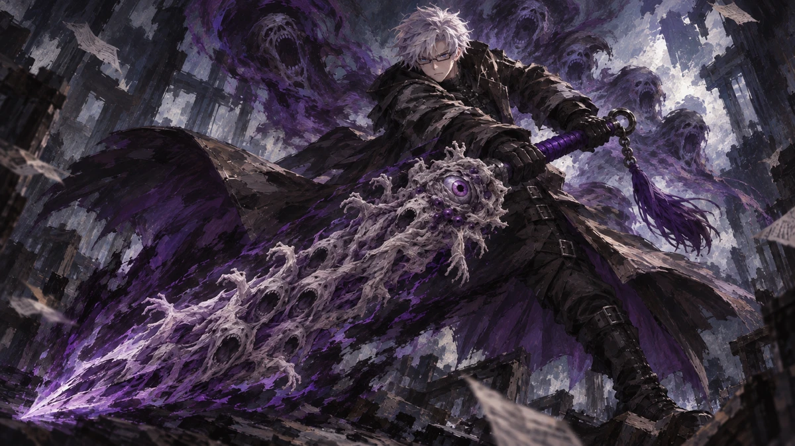

# Gsound · 双刀成章 / 空白领域

《边狱公司》自制人格模组 · 希斯克利夫 · 人格 ID 107970 · v1.11.25

**[展示网站](https://xuediner-source.github.io/Gsound/) · [下载模组](https://github.com/xuediner-source/Gsound/releases) · [完整 SVG 人格图](docs/identity/Gsound_完整人格图.svg)**

 

## 安装

1. 准备 BepInEx IL2CPP、Lethe、ModularSkillScripts。制作环境同时装有 motions.dll，建议保持同样的前置环境；本仓库不附带这些组件。
2. 关闭游戏，备份旧版 Gsound 文件夹。
3. 将 Releases 安装包中的 Gsound 放入 `BepInEx/plugins/Lethe/mods/`。从源码安装时使用 **mod/Gsound**，不要复制仓库根目录。
4. 确认没有重复的旧版活动桥接 DLL，再启动游戏。

中文文本位于 `custom_limbus_locale/EN`，请保留现有目录名。

## 中文人格图

9 页 SVG 与 PNG，涵盖两个阶段的技能、守备、被动及专属状态。SVG 内嵌字体、原画与图标；被动显示罪孽资源要求。「持有」是门槛，不是消耗。

- [第一阶段 · 基础技能](docs/identity/01_一阶段_基础技能.svg)
- [第一阶段 · 守备与追击](docs/identity/02_一阶段_守备与追击.svg)
- [第一阶段 · 特殊技能](docs/identity/03_一阶段_特殊技能.svg)
- [第二阶段 · 基础技能](docs/identity/04_二阶段_基础技能.svg)
- [第二阶段 · 守备与升级反击](docs/identity/05_二阶段_反击.svg)
- [第一阶段 · 被动技能](docs/identity/06_一阶段_被动技能.svg)
- [第二阶段 · 被动与状态](docs/identity/07_二阶段_被动与状态.svg)
- [专属状态 · 情人与回忆](docs/identity/08_专属状态_情人与回忆.svg)
- [专属状态 · 双刀与场地](docs/identity/09_专属状态_双刀与场地.svg)

## 当前状态

本包为 2026-09-13 当前安装版本快照。包含 1.11.24 共用 getter Hook 崩溃修补，以及 1.11.25 二阶段接近动作调整、隐藏升级反击登记。最新战斗修改已离线检查，仍需实机确认。二阶段 BGM 尚未完成；黑影、升级反击表现仍需复测。

## 目录

| 路径 | 内容 |
| --- | --- |
| mod/Gsound | 完整运行资源、DLL、Lua 与游戏数据 |
| src/bridge | 当前桥接源码及项目 |
| art | 原画、动作帧与参考素材 |
| docs | 展示网站与 SVG 人格图 |
| MANIFEST.json | 运行文件 SHA-256 校验清单 |

历史备份、日志、内存转储、旧 DLL 与中间构建包不纳入发布。

桥接构建：在 src/bridge 执行 `dotnet build -c Release -p:GameRoot="D:/游戏目录"`，需要 .NET SDK 与匹配的游戏/前置引用。项目引用路径已参数化，Plugin.cs 保持原样。

## 权属

非官方玩家作品，与 Project Moon 无官方关联。原版游戏和派生素材的权利属于各自权利人；公开仓库不代表授予第三方素材再许可。暂未设置统一开源许可证。
